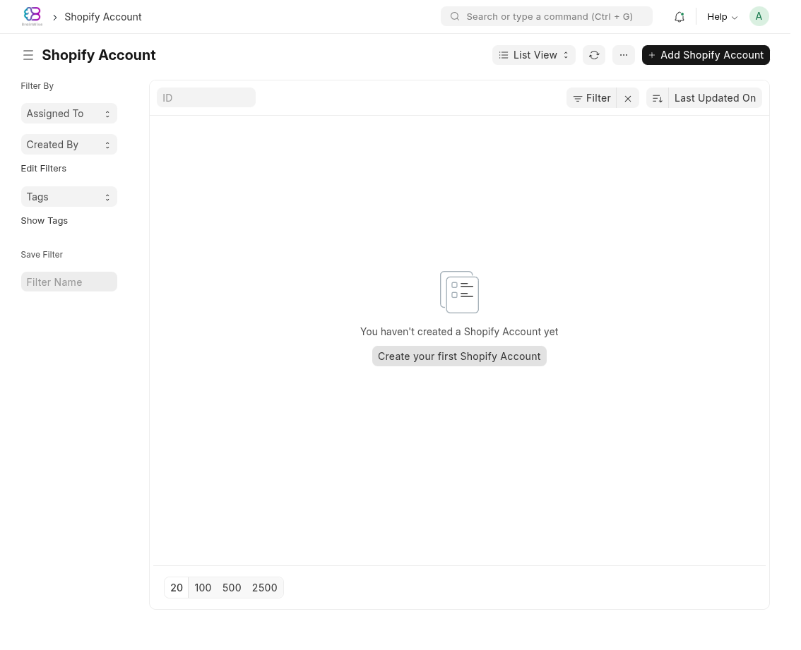
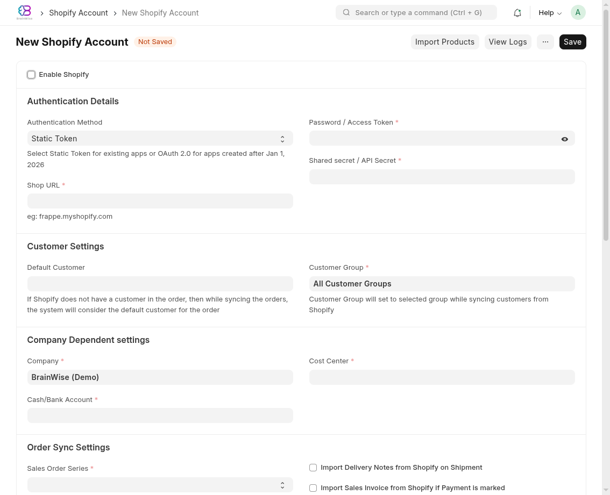
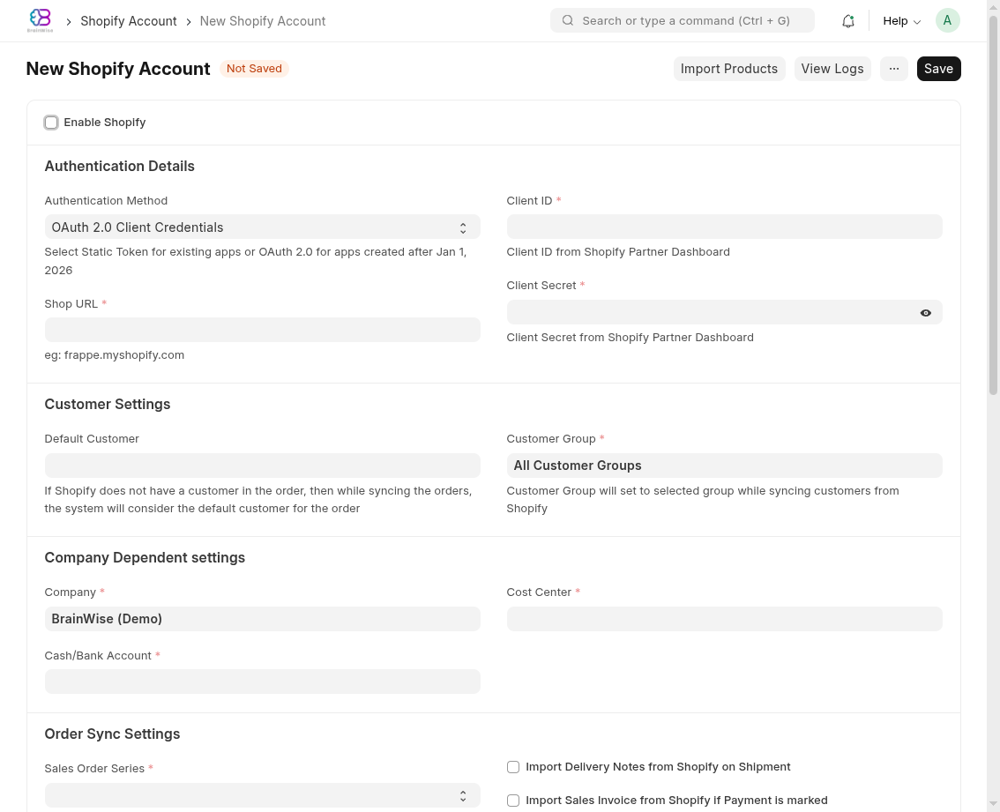
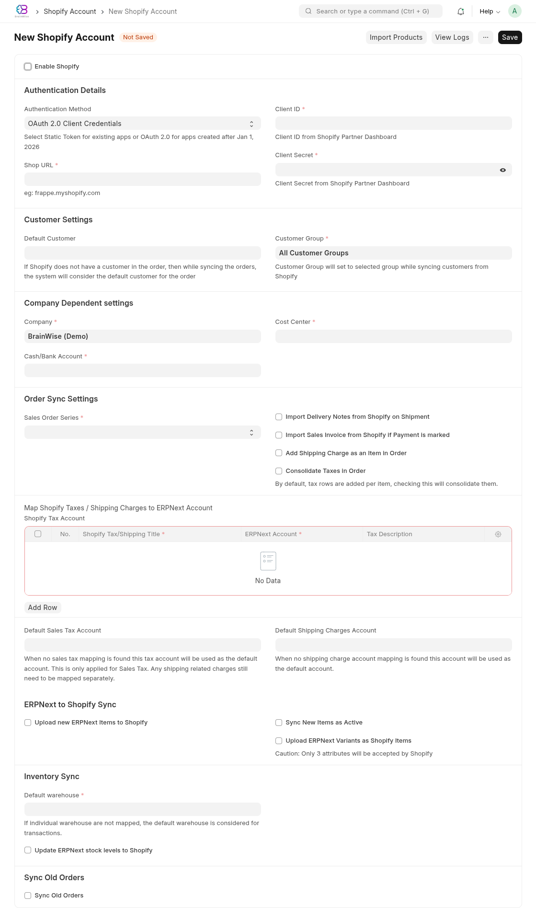

# Shopify Account — Onboarding & Operations Guide

End-to-end guide for setting up and running one or many Shopify stores against an existing ERPNext / Frappe site with `ecommerce_integrations` already installed.

**Audience:** Implementers and operators bringing a new Shopify store online. Each store is a separate **Shopify Account** record, scoped to one ERPNext **Company**.

---

## Table of contents

1. [Quick start checklist](#1-quick-start-checklist)
2. [Prerequisites](#2-prerequisites)
3. [Part 1 — Account setup](#3-part-1--account-setup)
4. [Part 2 — Per-account configuration](#4-part-2--per-account-configuration)
5. [Part 3 — Sync setup](#5-part-3--sync-setup)
6. [Part 4 — Pricing flow](#6-part-4--pricing-flow)
7. [Part 5 — Day-2 operations](#7-part-5--day-2-operations)
8. [Part 6 — Troubleshooting](#8-part-6--troubleshooting)
9. [Reference](#9-reference)

---

## 1. Quick start checklist

For a fresh client onboarding, work through these in order. Each step has a section below.

```
Prerequisites
[ ] ERPNext Company exists for this client
[ ] Default warehouse, cost center, cash/bank account exist for that Company
[ ] Customer Group, Default Customer, Item Group exist
[ ] Shopify store admin access (or Partner Dashboard for OAuth apps)

Part 1 — Account Setup
[ ] Decide auth method: Static Token or OAuth 2.0 Client Credentials
[ ] Create Shopify custom app and capture credentials
[ ] Create Shopify Account record with auth + Shop URL + Company
[ ] Save and verify webhooks were registered

Part 2 — Configuration
[ ] Map Shopify locations → ERPNext warehouses
[ ] Map Shopify taxes → ERPNext accounts
[ ] Set default sales tax + shipping account
[ ] Set Sales Order / Sales Invoice / Delivery Note series

Part 3 — Sync Setup
[ ] Choose sync direction: Shopify → ERPNext, ERPNext → Shopify, or both
[ ] Toggle product upload, inventory sync, invoice/DN creation
[ ] Run initial product import (Shopify → ERPNext)
[ ] (Optional) Sync historical orders

Part 4 — Pricing
[ ] Set Shopify Selling Rate on each item (or via Item Price)
[ ] Verify rate flows ERPNext → Shopify on first push
[ ] Verify Shopify rate flows back to ERPNext on first product import

Part 5 — Go live
[ ] Place a test order in Shopify and confirm Sales Order arrives
[ ] Mark it paid, fulfilled — confirm SI and DN are created
[ ] Watch Ecommerce Integration Log for first 24h
```

---

## 2. Prerequisites

### 2.1 On the Frappe / ERPNext side

| Item | Why | How to check |
|---|---|---|
| `ecommerce_integrations` installed on the site | Enables the Shopify Account doctype | Desk → **Installed Applications** should list `ecommerce_integrations` |
| ERPNext **Company** | Multi-tenant requires one Company per Shopify store | Desk → **Company** list |
| Default **Warehouse** under that company | Required as fallback when Shopify location isn't mapped | Filter Warehouses by company |
| **Cost Center** under that company | Required when invoice/DN sync is enabled | Cost Center list |
| **Cash/Bank Account** under that company | Required when Sales Invoice sync is enabled | Account list, type Cash or Bank |
| **Customer Group** | Used as default for synced customers | Customer Group list |
| **Default Customer** (e.g. *Walk-in*) | Fallback when Shopify order has no customer | Customer list |
| Document **Naming Series** for SO / SI / DN | Required if you want store-specific prefixes | Setup → Naming Series |

If any of these are missing, create them **before** creating the Shopify Account — saving the Shopify Account validates these references.

### 2.2 On the Shopify side

You need a custom app installed on the merchant's store, with the right scopes. The app gives you either a **static access token** (legacy) or **OAuth 2.0 client credentials** (apps created via the Dev Dashboard on/after **Jan 1, 2026**).

**Required Admin API scopes (minimum):**

```
read_products, write_products
read_orders, write_orders
read_customers, write_customers
read_inventory, write_inventory
read_locations
read_fulfillments, write_fulfillments
read_assigned_fulfillment_orders
read_merchant_managed_fulfillment_orders
```

**Webhook scope** is implicit — the app must be allowed to register webhooks to your callback URL.

---

## 3. Part 1 — Account setup

### 3.1 Choose the authentication method

| Method | Use when | Credentials needed |
|---|---|---|
| **Static Token** | Custom app created **before Jan 1, 2026**, or any app that still issues a long-lived access token (`shpat_…`) | `password` (Access Token), `shared_secret` (API Secret) |
| **OAuth 2.0 Client Credentials** | Custom app created via the **Shopify Dev Dashboard** on/after Jan 1, 2026 | `client_id`, `client_secret` |

You can mix methods across accounts — one client on Static Token, another on OAuth, all on the same site.

### 3.2 Create the Shopify custom app

#### 3.2.1 Static Token path

1. In Shopify Admin → **Settings** → **Apps and sales channels** → **Develop apps** → **Create an app**.
2. Configure Admin API scopes (list in §2.2).
3. **Install** the app.
4. From **API credentials**, copy:
   - **Admin API access token** → goes into the Shopify Account `Password / Access Token` field.
   - **API secret key** → goes into the `Shared secret / API Secret` field.

#### 3.2.2 OAuth 2.0 Client Credentials path

1. In the **Shopify Dev Dashboard** (`partners.shopify.com`), create an app or open the existing one.
2. Under app settings, enable **Client Credentials grant**.
3. Configure Admin API scopes.
4. Install the app on the merchant store.
5. Copy:
   - **Client ID** → goes into the Shopify Account `Client ID` field.
   - **Client Secret** → goes into the `Client Secret` field.

> **Webhook signing:** under OAuth 2.0, Shopify signs webhooks with the **Client Secret**, not a separate shared secret. The integration handles this automatically — you never set `shared_secret` on an OAuth account.

### 3.3 Create the Shopify Account record

In the desk, go to **Shopify Account** (URL: `/app/shopify-account`) → **+ New**.

On a fresh install you'll see the empty list with a **Create your first Shopify Account** button:



**Authentication Details:**

| Field | Static Token | OAuth 2.0 |
|---|---|---|
| Authentication Method | `Static Token` | `OAuth 2.0 Client Credentials` |
| Shop URL | `mystore.myshopify.com` (no `https://`) | same |
| Password / Access Token | `shpat_…` | *(hidden)* |
| Shared secret / API Secret | API secret | *(hidden)* |
| Client ID | *(hidden)* | from Dev Dashboard |
| Client Secret | *(hidden)* | from Dev Dashboard |

The form swaps fields automatically based on your **Authentication Method** selection — you only see the fields relevant to the chosen method.

**Static Token mode** (default; for apps created before Jan 1, 2026):



**OAuth 2.0 mode** (for apps created via Shopify Dev Dashboard on or after Jan 1, 2026):



Notice that switching the dropdown hides `Password / Access Token` + `Shared secret / API Secret` and reveals `Client ID` + `Client Secret` (with the eye-toggle for the masked secret). The hidden token-storage fields (`oauth_access_token`, `token_expires_at`) stay invisible in both modes — they're auto-managed.

**Company-Dependent settings:**

| Field | Notes |
|---|---|
| Company | The ERPNext Company this store belongs to. **Cannot be changed later** without recreating the account. |
| Cash/Bank Account | Required if you'll sync Sales Invoices |
| Cost Center | Required if you'll sync SI / DN |

Leave **Enable Shopify** **unchecked** for now — we'll turn it on once configuration is complete.

Below are all the sections you'll see on the form (full-page view in OAuth mode):



Click **Save**.

### 3.4 What happens on first save with OAuth

If you chose OAuth and saved with credentials filled in, the controller's `before_save` hook does this in order:

1. **Validates credentials** by calling `https://{shop}/admin/oauth/access_token` with `grant_type=client_credentials`.
2. On success, mints a token (~24h validity, Shopify returns `expires_in: 86399`).
3. Stores the token in the hidden `oauth_access_token` field (encrypted) and the expiry datetime in `token_expires_at`.
4. You'll see a green flash: *"OAuth credentials validated successfully."*

If validation fails, save is blocked and the error appears in **Ecommerce Integration Log**. Common causes:
- Wrong shop URL (typo, `https://` prefix, missing `.myshopify.com`)
- Client app not installed on the shop
- App doesn't have Client Credentials grant enabled
- Network can't reach Shopify

### 3.5 Enable + register webhooks

1. Tick **Enable Shopify**.
2. Save.

The `_handle_webhooks` step now runs. It uses the right token automatically (OAuth: minted token; Static: the Access Token) to register webhooks for:

- `orders/create`
- `orders/paid`
- `orders/fulfilled`
- `orders/cancelled`
- `orders/partially_fulfilled`

If registration fails, you'll see *"Failed to register webhooks with Shopify. Please check credentials and retry. Disabling and re-enabling the integration might also help."* That message means Shopify rejected the registration — **almost always a credentials or scope issue**.

You can verify in Shopify Admin → **Settings** → **Notifications** → **Webhooks**, or via API:

```bash
curl -H "X-Shopify-Access-Token: $TOKEN" \
  https://mystore.myshopify.com/admin/api/2024-01/webhooks.json
```

---

## 4. Part 2 — Per-account configuration

These all live on the same Shopify Account form.

### 4.1 Customer settings

| Field | Notes |
|---|---|
| Default Customer | Used when Shopify order has no customer email |
| Customer Group | Applied to every Shopify-synced customer |

### 4.2 Warehouse mappings (locations)

Shopify exposes locations (warehouses, retail floor, etc.). Each must map to a real ERPNext warehouse **in the same company** as this account.

**Steps:**

1. On the Shopify Account form, click **Fetch Shopify Locations**.
2. The child table **Shopify Warehouse Mapping** populates with each Shopify location.
3. For each row, set **ERPNext Warehouse** (filtered to this company).
4. The first row's warehouse acts as the **Default warehouse** for that account if not separately set.

If you skip mapping a location, orders fulfilled from that location will fall back to the default warehouse. If even that's missing, sync errors appear in the Integration Log.

### 4.3 Tax mappings

Shopify sends tax line items by **title** (e.g. *"VAT 15%"*, *"GST"*). Each title needs an ERPNext tax account.

In the **Map Shopify Taxes / Shipping Charges to ERPNext Account** table:

| Shopify Tax/Shipping Title | ERPNext Account | Description |
|---|---|---|
| `VAT 15%` | `VAT Payable - Company` | Saudi VAT |
| `Standard Shipping` | `Shipping Charges - Company` | Shipping line |

For unmapped titles, the integration uses:

- **Default Sales Tax Account** — fallback for any unmapped tax title
- **Default Shipping Charges Account** — fallback for unmapped shipping titles

Both are required when sync is enabled.

### 4.4 Document series

| Field | Example | Required when |
|---|---|---|
| Sales Order Series | `SO-SHOP-` | Always (orders) |
| Sales Invoice Series | `SINV-SHOP-` | If "Import Sales Invoice from Shopify if Payment is marked" is on |
| Delivery Note Series | `DN-SHOP-` | If "Import Delivery Notes from Shopify on Shipment" is on |

Use distinct prefixes per store for traceability (e.g. `SO-KSA-`, `SO-UAE-`).

---

## 5. Part 3 — Sync setup

### 5.1 Sync direction matrix

| Direction | What syncs | Trigger |
|---|---|---|
| **Shopify → ERPNext** (always on) | Orders, customers, addresses, fulfillments | Webhooks |
| **ERPNext → Shopify** (opt-in) | Items, prices, stock levels | Item save / scheduled |
| **Shopify → ERPNext** (one-time) | Existing products | Manual via *Shopify Import Products* page |
| **Shopify → ERPNext** (one-time) | Historical orders | Manual via *Sync Old Orders* section |

### 5.2 Order Sync Settings

| Toggle | Effect |
|---|---|
| Import Delivery Notes from Shopify on Shipment | When `orders/fulfilled` arrives, create a Delivery Note |
| Import Sales Invoice from Shopify if Payment is marked | When `orders/paid` arrives, create a Sales Invoice |
| Add Shipping Charge as an Item in Order | Adds shipping as a separate Item line on the SO instead of a tax row |
| Consolidate Taxes in Order | Roll per-item tax rows into a single tax row |

**Recommended starting setup:** turn ON DN-on-shipment and SI-on-paid; turn OFF the shipping-as-item unless you specifically need it as a stockable item.

### 5.3 Inventory Sync (ERPNext → Shopify)

| Field | Notes |
|---|---|
| Update ERPNext stock levels to Shopify | Master switch |
| Inventory Sync Frequency | 5 / 10 / 15 / 30 / 60 min |
| Last Inventory Sync | Auto-managed read-only timestamp |

When enabled, a scheduled job pushes ERPNext stock balances (per mapped warehouse) to the matching Shopify location.

### 5.4 ERPNext → Shopify product sync

| Toggle | Effect |
|---|---|
| Upload new ERPNext Items to Shopify | When a new ERPNext Item is created (matching this company), push it to Shopify |
| Update Shopify Item after updating ERPNext item | On Item edit, push changes (price, name, description) to Shopify |
| Sync New Items as Active | New items appear as published, not draft |
| Upload ERPNext Variants as Shopify Items | Treat each variant as a separate Shopify product (only 3 attributes supported by Shopify) |

### 5.5 Initial product import (Shopify → ERPNext)

For onboarding an existing store with an existing catalog:

1. From the Shopify Account form → **Import Products** button (top right).
2. The **Shopify Import Products** page opens. It paginates through all products on the store.
3. For each product, it creates an ERPNext Item (skips if the SKU already exists), creates the variant Items, sets `shopify_selling_rate`, and creates the corresponding **Ecommerce Item** linkage.

Run this once during onboarding. After this, ongoing changes flow via webhooks (Shopify → ERPNext) or scheduled jobs (ERPNext → Shopify) depending on your toggles.

### 5.6 Historical order sync (one-time)

If you want orders that existed in Shopify *before* the integration was set up:

1. In **Sync Old Orders** section, set **From** and **To** dates.
2. Tick **Sync Old Orders**.
3. Save. A background job paginates through Shopify orders in that range and creates SOs (and DNs/SIs based on order status).

`is_old_data_migrated` is set to 1 after completion to prevent re-runs.

---

## 6. Part 4 — Pricing flow

This is where most clients trip up. There are two prices to think about:

| Price | Lives in | Field |
|---|---|---|
| **Shopify Selling Rate** | ERPNext Item | Custom field `shopify_selling_rate` (Currency) |
| **ERPNext Selling Rate** | Item Price (linked to Item + Price List) | Standard `price_list_rate` |

The integration uses **`shopify_selling_rate`** as the canonical price for Shopify sync. It's separate from the regular ERPNext `standard_rate` and `price_list_rate` so you can keep retail pricing decoupled from B2B/wholesale price lists.

### 6.1 Setting price on an ERPNext Item (then push to Shopify)

1. Open the **Item** in ERPNext.
2. Locate **Shopify Selling Rate** (sits next to `standard_rate`).
3. Set the value (e.g. `199.00`).
4. Save.

If **Update Shopify Item after updating ERPNext item** is enabled on the corresponding Shopify Account, the new price is pushed to Shopify on save. Otherwise it goes out on the next manual upload.

### 6.2 Setting price on Shopify (and importing it to ERPNext)

When a product is imported via **Shopify Import Products** (or created on Shopify after integration), the integration:

1. Creates the ERPNext Item if missing.
2. Reads Shopify's `variant.price` and writes it to the new Item's `shopify_selling_rate`.
3. **Does not** automatically create an Item Price record — that's intentional, so it doesn't conflict with your existing ERPNext price lists.

If you also want it as an Item Price in ERPNext, create that manually or via a server script.

### 6.3 Multi-store pricing strategy

Since each Shopify Account is one Company, and `shopify_selling_rate` is one field on the Item, you have two patterns:

**Pattern A — One Item per company (recommended for distinct catalogs):**
- Each company has its own Items (different `item_code`, e.g. `KSA-SKU-001` vs `UAE-SKU-001`).
- Each Item has its own `shopify_selling_rate`.
- Clean, but duplicates SKU rows.

**Pattern B — Shared Item across companies (only when prices match):**
- Same Item used by both Shopify Accounts.
- One `shopify_selling_rate` value.
- Both stores must price the item identically. If they diverge, you must move to Pattern A or extend the schema.

The integration as shipped supports Pattern A out of the box. Pattern B with diverging prices is a customization (per-company-per-item price field), not implemented here.

### 6.4 Price flow diagram

```
ERPNext side                                Shopify side
─────────────                               ────────────
Item.shopify_selling_rate ─────[push]─────► variant.price
                                            (on save, if "Update Shopify
                                            Item after updating ERPNext
                                            item" is on)

Item.shopify_selling_rate ◄─────[pull]───── variant.price
                                            (on Shopify Import Products,
                                            or first time a webhook
                                            references a new variant)
```

---

## 7. Part 5 — Day-2 operations

### 7.1 Adding a second (third, Nth) store

1. Repeat **Part 1** — create another Shopify Account, with a different Company.
2. Repeat **Part 2** — its own warehouses, taxes, and series.
3. Each store is fully isolated; webhooks route by `X-Shopify-Shop-Domain` header to the right account.

There's no per-installation limit — add as many as the bench can handle.

### 7.2 Monitoring

| Where | What to watch |
|---|---|
| **Ecommerce Integration Log** list (`/app/ecommerce-integration-log`) | Every webhook, every sync, every error. Filter by Status = Error |
| **Shopify Account** list | Disabled accounts, missing fields |
| **Item** list filtered by `shopify_product_id IS NOT NULL` | Items currently linked to Shopify |

Set up an Auto Email Report on the Integration Log filtered by `status = Error` for daily summaries.

### 7.3 OAuth token lifecycle

OAuth tokens issued by Shopify last ~24 hours. The integration:

1. **Caches** the token in `oauth_access_token` with `token_expires_at`.
2. Before each API call, `get_valid_access_token()` checks expiry with a 5-minute buffer.
3. If expired or expiring soon, calls `refresh_oauth_token()` to mint a new one.
4. **One retry** on transient failure with a 1-second pause.

You don't need a cron job for token refresh — it happens on-demand. If `client_id` or `client_secret` change, the old cached token is invalidated automatically because `before_save` triggers a re-mint.

### 7.4 Disabling a store (without deleting it)

1. Open the Shopify Account → uncheck **Enable Shopify** → Save.
2. The integration unregisters all webhooks pointing at this site (using whatever token is still valid).
3. The account record stays in the DB; re-enabling re-registers webhooks.

### 7.5 Migrating from Static Token to OAuth

For an existing account on Static Token that needs to switch (e.g. Shopify deprecates the old custom app):

1. Create the new OAuth app in the Dev Dashboard, install on the same shop.
2. Open the existing Shopify Account.
3. Change **Authentication Method** from `Static Token` to `OAuth 2.0 Client Credentials`.
4. Fill in `Client ID` and `Client Secret`.
5. Save. The validator hits Shopify with the new creds and mints a token.
6. Webhooks **may need to be re-registered** if the new app has a different signing secret. To force this:
   - Untick **Enable Shopify** → Save (unregisters)
   - Tick **Enable Shopify** → Save (registers using OAuth token)

The legacy `password` and `shared_secret` fields are kept in the DB but ignored when method is OAuth. Clear them if you want, but they don't cause harm.

---

## 8. Part 6 — Troubleshooting

### 8.1 "Failed to authenticate with Shopify using OAuth 2.0"

**Source:** `connection._get_access_token` log entry.

| Cause | Fix |
|---|---|
| Wrong `shop_url` (e.g. `mystore.myshopify.com/admin`) | Strip path, just `mystore.myshopify.com` |
| Client app not installed on shop | Install via Partner Dashboard |
| Client Credentials grant not enabled in Dev Dashboard | Toggle it on the app settings page |
| Bench can't reach `accounts.shopify.com` (firewall, proxy) | Open egress, configure `https_proxy` |

### 8.2 "Webhook validation failed: Secret key not configured"

**Source:** `connection.store_request_data`.

For OAuth accounts, the integration uses `client_secret` for HMAC verification. If empty, this error fires.

Open the account, re-enter `Client Secret`, save.

### 8.3 "Unverified Webhook Data"

The HMAC the integration computed didn't match what Shopify sent. Possible causes:

| Cause | Fix |
|---|---|
| Wrong secret in DB (e.g. someone copied the API key instead of the API secret) | Re-paste the right value |
| Mixed up `shared_secret` with OAuth `client_secret` after switching auth method | Make sure the right secret is set for the active method |
| Webhook was registered with one secret, then secret was rotated | Disable + re-enable the account to re-register |

### 8.4 "Failed to register webhooks with Shopify"

Almost always credentials or scopes:

```
1. Verify token works:
   curl -H "X-Shopify-Access-Token: $TOKEN" https://mystore.myshopify.com/admin/api/2024-01/shop.json

2. Verify scopes include orders/inventory/products:
   curl -H "X-Shopify-Access-Token: $TOKEN" https://mystore.myshopify.com/admin/oauth/access_scopes.json

3. Verify callback URL is reachable from Shopify (must be HTTPS, not 127.0.0.1):
   The integration uses `https://{site}/api/method/ecommerce_integrations.shopify.connection.store_request_data`
```

For local dev, set `localtunnel_url` in your site config so webhooks resolve to a tunneled URL.

### 8.5 Orders arrive but Sales Invoices/Delivery Notes aren't created

Check on the Shopify Account:
- Is **Import Sales Invoice from Shopify if Payment is marked** ticked? (for SI)
- Is **Import Delivery Notes from Shopify on Shipment** ticked? (for DN)
- Is **Sales Invoice Series** / **Delivery Note Series** set? (mandatory if those toggles are on)
- Is **Cash/Bank Account** set? (mandatory for SI)
- Is **Cost Center** set? (mandatory for SI/DN)

Then check **Ecommerce Integration Log** for the `orders/paid` or `orders/fulfilled` event — it'll show the actual error if creation failed.

### 8.6 Token never refreshes (OAuth)

Check `token_expires_at` in the DB:

```sql
SELECT name, authentication_method, token_expires_at
FROM `tabShopify Account` WHERE name = 'mystore.myshopify.com';
```

If it's old and the integration is making API calls, but the token isn't being refreshed, look at the log for `oauth.refresh_oauth_token` failures. The most common cause is the client app being uninstalled from the shop after the initial token was minted.

---

## 9. Reference

### 9.1 Shopify Account field reference

| Section | Field | Type | Required | Notes |
|---|---|---|---|---|
| Header | `enable_shopify` | Check | — | Master on/off; controls webhook registration |
| Auth | `authentication_method` | Select | Yes | `Static Token` or `OAuth 2.0 Client Credentials` |
| Auth | `shopify_url` | Data | Yes | `xxx.myshopify.com` (no scheme, no path) |
| Auth | `password` | Password | Static only | Admin API access token |
| Auth | `shared_secret` | Data | Static only | API Secret for HMAC |
| Auth | `client_id` | Data | OAuth only | From Dev Dashboard |
| Auth | `client_secret` | Password | OAuth only | From Dev Dashboard |
| Auth | `oauth_access_token` | Password | auto | Hidden, encrypted, auto-managed |
| Auth | `token_expires_at` | Datetime | auto | Hidden, auto-managed |
| Customer | `default_customer` | Link Customer | recommended | Fallback on customerless orders |
| Customer | `customer_group` | Link Customer Group | yes (when enabled) | Applied to synced customers |
| Company | `company` | Link Company | yes | One company per account |
| Company | `cash_bank_account` | Link Account | yes (when enabled) | For SI |
| Company | `cost_center` | Link Cost Center | yes (when enabled) | For SI/DN |
| Order Sync | `sales_order_series` | Select | yes | Naming series |
| Order Sync | `sync_delivery_note` | Check | — | Toggle DN sync |
| Order Sync | `sync_sales_invoice` | Check | — | Toggle SI sync |
| Order Sync | `delivery_note_series` | Select | yes if DN on | |
| Order Sync | `sales_invoice_series` | Select | yes if SI on | |
| Order Sync | `add_shipping_as_item` | Check | — | |
| Order Sync | `consolidate_taxes` | Check | — | |
| Tax | `taxes` | Table | recommended | Title → Account map |
| Tax | `default_sales_tax_account` | Link Account | recommended | Fallback |
| Tax | `default_shipping_charges_account` | Link Account | recommended | Fallback |
| Outbound | `upload_erpnext_items` | Check | — | Toggle ERPNext → Shopify product create |
| Outbound | `update_shopify_item_on_update` | Check | — | Toggle ERPNext → Shopify update |
| Outbound | `sync_new_item_as_active` | Check | — | |
| Outbound | `upload_variants_as_items` | Check | — | |
| Inventory | `update_erpnext_stock_levels_to_shopify` | Check | — | Master toggle |
| Inventory | `inventory_sync_frequency` | Select | yes if inventory on | Minutes |
| Inventory | `warehouse` | Link Warehouse | yes when enabled | Default warehouse |
| Inventory | `shopify_warehouse_mapping` | Table | yes when enabled | Per-location mapping |
| Inventory | `last_inventory_sync` | Datetime | auto | Read-only |
| Old Orders | `sync_old_orders` | Check | — | One-time historical sync |
| Old Orders | `old_orders_from`, `old_orders_to` | Datetime | yes if syncing | Range |
| Old Orders | `is_old_data_migrated` | Check | auto | Prevents re-runs |

### 9.2 Webhook events

The integration registers these on enable:

| Topic | Handler | What it does |
|---|---|---|
| `orders/create` | `order.sync_sales_order` | Create Sales Order + Customer |
| `orders/paid` | `invoice.prepare_sales_invoice` | Create Sales Invoice (if enabled) |
| `orders/fulfilled` | `fulfillment.prepare_delivery_note` | Create Delivery Note (if enabled) |
| `orders/partially_fulfilled` | `fulfillment.prepare_delivery_note` | Same, partial |
| `orders/cancelled` | `order.cancel_order` | Cancel SO/SI/DN |

Webhook routing: incoming requests are matched to a Shopify Account by the `X-Shopify-Shop-Domain` header.

### 9.3 Custom fields added by the integration

Created on `setup_custom_fields()`:

| DocType | Field | Notes |
|---|---|---|
| Item | `shopify_selling_rate` | Canonical Shopify price |
| Item | `shopify_product_id`, `shopify_variant_id` | Linkage |
| Customer | `shopify_customer_id` | Linkage |
| Supplier | `shopify_supplier_id` | Linkage |
| Address | `shopify_address_id` | Linkage |
| Sales Order | `shopify_order_id`, `shopify_order_number`, `shopify_order_status` | Linkage + status mirror |
| Sales Order Item | `shopify_discount_per_unit` | Per-unit discount |
| Delivery Note | `shopify_order_id`, `shopify_order_number`, `shopify_order_status`, `shopify_fulfillment_id` | Linkage |
| Sales Invoice | `shopify_order_id`, `shopify_order_number`, `shopify_order_status` | Linkage |

### 9.4 Files of interest (for developers)

| File | Purpose |
|---|---|
| `shopify/oauth.py` | Token mint, refresh, validation |
| `shopify/connection.py` | Session decorator, webhook ingress, HMAC verification |
| `shopify/doctype/shopify_account/shopify_account.py` | DocType controller, validators, webhook registration |
| `shopify/doctype/shopify_account/shopify_account.json` | Field definitions |
| `shopify/order.py`, `invoice.py`, `fulfillment.py` | Webhook handlers |
| `shopify/product.py` | Product import + push |
| `shopify/inventory.py` | Stock sync |
| `patches/set_default_shopify_auth_method.py` | One-time backfill of auth method on existing accounts |

### 9.5 API version

The integration is pinned to `API_VERSION = "2024-01"` in `shopify/constants.py`. Bump this when you need access to newer Shopify features and validate against their migration notes.

---

## Appendix A — Onboarding template

Use this template when bringing a new client live. Fill it in before you start clicking.

```
Client: ________________________________________
ERPNext Company: _______________________________
Shop URL: ______________________________________

Auth method:           [ ] Static Token   [ ] OAuth 2.0
  If Static, token:     shpat_____________________
  If OAuth, client id:  ___________________________

Default Warehouse:     ________________________________
Cost Center:           ________________________________
Cash/Bank Account:     ________________________________
Default Customer:      ________________________________
Customer Group:        ________________________________

Naming Series:
  Sales Order:         _______________
  Sales Invoice:       _______________
  Delivery Note:       _______________

Toggles:
  [ ] Import DN on shipment
  [ ] Import SI on paid
  [ ] Add shipping as item
  [ ] Consolidate taxes
  [ ] Upload ERPNext items to Shopify
  [ ] Update Shopify item on ERPNext update
  [ ] Update ERPNext stock to Shopify (frequency: ____ min)

Initial sync:
  [ ] Run Shopify Import Products
  [ ] Sync old orders from ____________ to ____________

Verification (after go-live):
  [ ] Test order placed in Shopify, SO arrives
  [ ] Order paid, SI created
  [ ] Order fulfilled, DN created
  [ ] Item edited in ERPNext, change visible in Shopify
  [ ] Stock changed in ERPNext, level visible in Shopify
```
